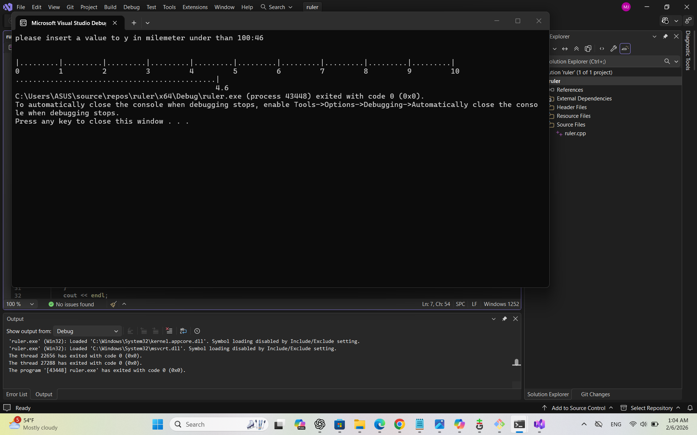

C++ Ruler Generator Project 📏
This is a simple yet effective C++ program designed to generate a visual representation of a ruler based on user input.

🛠️ Description
The program takes a specific length in millimeters (under 100mm) and prints a formatted ruler using characters. It includes built-in input validation to ensure the user enters a value within the correct range.

### Preview of the Output:

✨ Key Features
User Interaction: Prompts the user to insert a length value in millimeters.

Input Validation: If the user enters a value greater than 100, the program warns them and asks for a new value.

Visual Representation: Uses loops to draw tick marks (| and .) and numbers to simulate a real ruler.

🚀 How to Run
Open the ruler.cpp file in any C++ IDE (like Visual Studio or CLion) or an online compiler.

Compile and run the code.

Enter a value (e.g., 50) to see the ruler generated in your terminal. 
